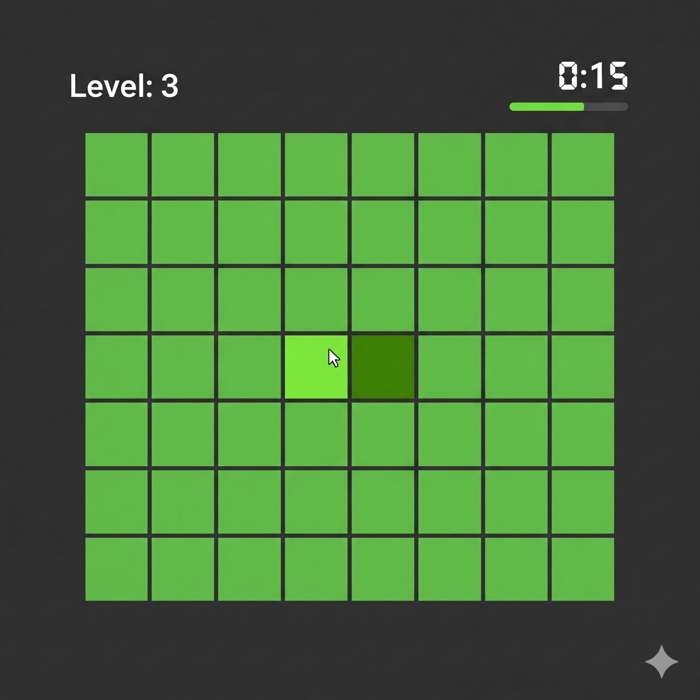

# 🎨 절대색감 테스트 (Color Expert Test) - 당신의 색감 점수는?

> **"당신은 미세한 색의 차이를 구분할 수 있습니까?"** > [상담모아(Sangdammoa)](https://sangdammoa.com)에서 제공하는 공식 절대색감 테스트 게임의 홍보 및 백링크 페이지입니다.

---

## 🔍 프로젝트 소개 (Introduction)

이 저장소는 **[상담모아 절대색감 테스트](https://sangdammoa.com/fun/color_expert)**를 소개하고, 사용자들이 자신의 시각적 민감도를 재미있게 측정해볼 수 있도록 안내하기 위해 제작되었습니다. 

현대 사회에서 디자인적 감각과 색채 심리는 비즈니스와 일상 모두에서 중요한 요소입니다. 본 테스트를 통해 당신의 눈이 얼마나 정확한지, 그리고 당신의 '절대색감' 등급이 상위 몇 %인지 확인해보세요.

## 🎮 주요 특징 (Key Features)

* **정밀한 난이도 설계**: 단계가 올라갈수록 채도와 명도의 차이가 미세해져 진정한 전문가를 가려냅니다.
* **즉각적인 피드백**: 게임 종료 후 자신의 점수와 등급(예: 색감 천재, 일반인, 똥손 등)을 바로 확인할 수 있습니다.
* **모바일 최적화**: 언제 어디서나 스마트폰으로 간편하게 즐길 수 있는 반응형 웹 게임입니다.
* **두뇌 자극**: 단순한 재미를 넘어 집중력과 관찰력을 향상시키는 시각 훈련 효과가 있습니다.

## 🚀 시작하기 (How to Play)

1.  **[상담모아 테스트 페이지](https://sangdammoa.com/fun/color_expert)**에 접속합니다.
2.  화면에 나타난 여러 개의 사각형 중, **색깔이 미세하게 다른 하나**를 찾아 클릭합니다.
3.  제한 시간 내에 최대한 많은 단계를 통과하여 높은 점수를 획득하세요!

---

## 💡 고득점 팁 (Pro Tips)

* **화면 밝기**: 기기의 화면 밝기를 80% 이상으로 설정하면 색 구분이 더 명확해집니다.
* **블루라이트 차단 해제**: 야간 모드나 블루라이트 필터가 켜져 있으면 색 왜곡이 발생할 수 있으니 잠시 꺼두는 것을 권장합니다.
* **주변 조명**: 너무 밝은 곳보다는 적당히 어두운 실내에서 테스트할 때 집중력이 높아집니다.

## 🔗 관련 링크 (Official Links)

* **공식 홈페이지**: [상담모아 (Sangdammoa)](https://sangdammoa.com)
* **테스트 바로가기**: [절대색감 테스트 게임](https://sangdammoa.com/fun/color_expert)
